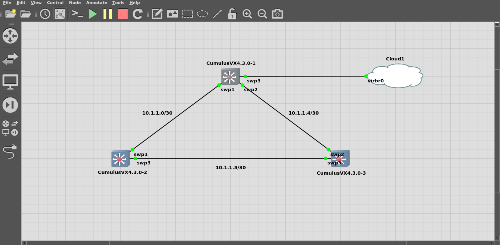
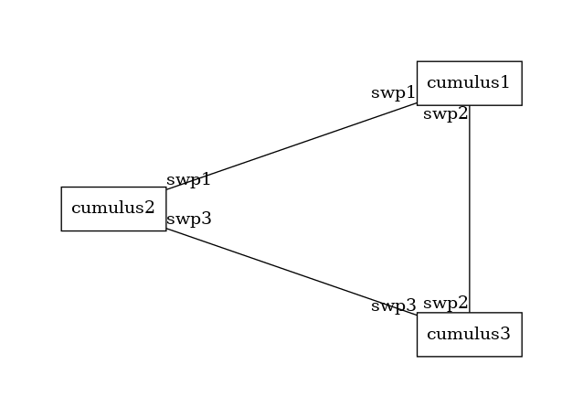

# Network Mapper 
This project is a small piece of python scripting that can be used to
generate a network graph from network devices running cumulus. It has been tested on 
a gns3 simulation with cumulus 4.3.0 virtual appliances.

## Methodology
The cumulus devices, once connected, use LLDP out of the box to get network information of the devices directly connected to 
its ports. The tool will basically pull this information from the appliances over SSH and then generate the map.

## Dependencies
The script uses the graphviz utility and this needs to be installed for the graph generation to work correctly. 

You can install it using `sudo apt install graphviz`

## Installation and running 
* To install the script, first clone it into a directory.
* Enter the directory and create a venv environment using `python3 -m venv venv`
* Activate the virtual environment with the command `source venv/bin/activate`
* Install the requirements with `pip install -r requirements.txt`
* Enter the hosts.txt file and fill in the IP addresses of the hosts, or the hostnames if they are resolvable by DNS
* Ensure that the same SSH username and password are used on all the cumulus devices as the script will ssh into the 
  devices to retrieve the data.
* The default username of **cumulus** is used, and you can set the `SSHUSER` env variable in the shell to change it using `export SSHUSER=<username>`  
* The password has to be exported as a shell variable for adding some security and you can set the password as `export SSHPASS=<ssh password>`
* Run the script using `python runMapper.py`, and it should generate a graph of the network named `network-diagram.png` in the directory.
* In some cases, depending on the ssh requirements, it may be necessary to drop to a root prompt and run the script to avoid issues with certificate checks.

Sample Output 
The test environment in GNS3 looks as follows :

The output from the script looks as follows

